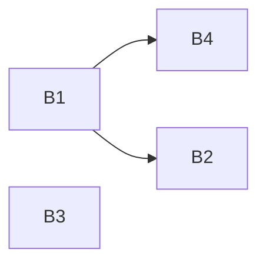

# Stage 3 实验报告

2022011223 熊泽恩

## 实验内容

为了完成这次实验，我进行了以下工作：

- 添加了 `frontend/scope/scopestack.py`，完成了 `ScopeStack` 类，实现了作用域栈的功能。
  - 新建了 `newScope` 函数，实现新建一个（局部）作用域，并将其压入作用域栈内。
  - 新建了 `lookup` 函数，实现了按照“从栈顶到栈底”，即从内层作用域到外层作用域的顺序，查找能否获取符号。

- 修改了 `frontend/typecheck/typer.py`，将 `Visitor[Scope, None]` 改为了 `Visitor[ScopeStack, None]`。
- 修改了 `frontend/typecheck/namer.py` 中的相关语句，把 `ctx` 的类型改为 `ScopeStack`。
  - 修改了 `Namer.visitFunction` 和 `Namer.visitBlock`，在函数开始时局部作用域压栈，并在函数结束时把对应作用域退栈。
  - 修改了 `Namer.visitDeclaration`，只在当前的（栈顶）作用域里查找符号是否被声明。


## Stage 3 思考题

### Step 6

#### 第 1 题

> 请画出下面 MiniDecaf 代码的控制流图。
>
> ```c
> int main(){
>     int a = 2;
>     if (a < 3) {
>         {
>             int a = 3;
>             return a;
>         }
>         return a;
>     }
> }
> ```

上述代码可以写成以下中间代码：

```assembly
FUNCTION<main>:
    _T1 = 2
    _T0 = _T1
    _T2 = 3
    _T3 = (_T0 < _T2)
    if (_T3 == 0) branch _L1
    _T5 = 3
    _T4 = _T5
    return _T4
    return _T0
_L1:
    return
```

可以被分为以下 3 个基本块：

B1：

```assembly
FUNCTION<main>:
    _T1 = 2
    _T0 = _T1
    _T2 = 3
    _T3 = (_T0 < _T2)
    if (_T3 == 0) branch _L1
```

B2：

```assembly
    _T5 = 3
    _T4 = _T5
    return _T4
```

B3：

```assembly
    return _T0
```

B4：

```assembly
_L1:
    return
```

流程图为：



